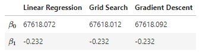

# Bike Sales: EDA and Prdictions using Grid Search vs. Gradient Descent Algorithm

Exploratory data analysis (EDA) is conducted on a dataset for selling prices of used motorcycles. The selling prices are predicted using algorithms like Grid Search and Gradient Descent which are built from scratch.

Key features:

- Exploratory data analysis (EDA)
- Bar plot, Histogram, Correlation Plot, Scatter Plot Matrix, Box Plot
- Loss Function
- Grid Search
- Gradient Descent Algorithm
- Linear Regression

Modules used:

- `numpy`: Python library used for working with arrays
- `pandas`: data manipulation and analysis. In particular, it offers data structures and operations for manipulating numerical tables and time series.
- `matplotlib.pyplot`: plotting library for creating static, animated, and interactive visualizations
- `scipy.stats`: modules for statistics, optimization, integration, linear algebra, Fourier transforms, signal and image processing, ODE solvers, and more
- `seaborn`: visualization library of a high-level interface for drawing attractive statistical graphics
- `math`: provides access to the mathematical functions

## Project Report

[Project report](https://htmlpreview.github.io/?https://raw.githubusercontent.com/chsueh2/Grid_Search_GD/main/BikeSales_EDA_GridSearch_GD.html) ([HTML](./BikeSales_EDA_GridSearch_GD.html))([Jupyter Notebook](./BikeSales_EDA_GridSearch_GD.ipynb)).

The analysis results with theoretical backgrounds are included.

Chien-Lan Hsueh (chienlan.hsueh at gmail.com)

## Overview and Project Goal

Conduct an exploratory data analysis (EDA) on selling prices of used motorcycles. To predict a value of selling price for a new motorcycle, we use a linear model and want to find the best values of model parameters that minimizes the loss function - Root Mean Square Error (RMSE). Two methods to minimize the loose function will be implemented: (1) Grid Search and (2) Gradient Descent.

The obtained predictions will then be compared to the prediction from a linear regression.

## Workflow

1. Data and EDA
1. Prediction Algorithms
   - Grid Search
   - Gradient Descent
1. Comparison to Linear Regression
1. Conclusion

